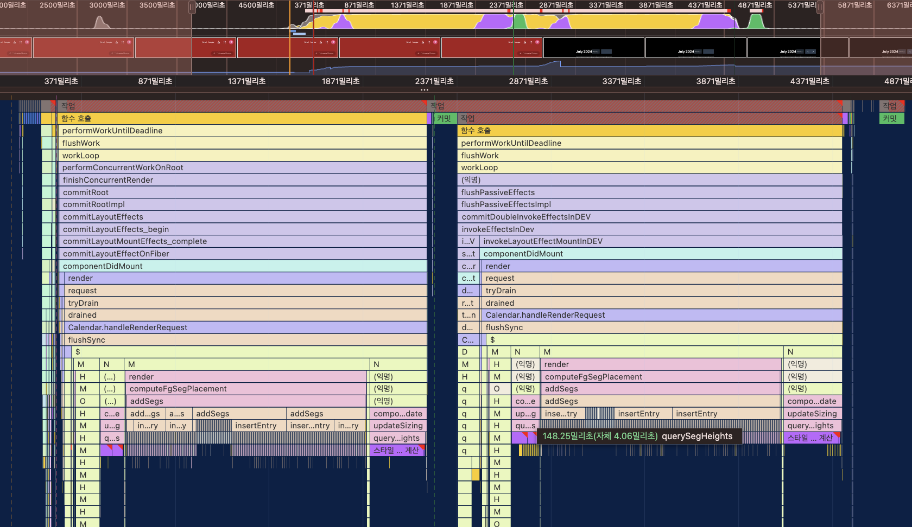

## Fullcalendar에서 3000개의 데이터를 로드할 때 버벅이는 이슈 확인해보기

### 실행

```bash
npm dev
# or
yarn dev
```

### 내용

이전 캘린더 프로젝트를 진행하면서 많은 수의 데이터를 Fullcalendar에 사용할 때 버벅이는 이슈가 있었다. 이 이슈를 해결하기 위해 특정 옵션을 사용해 해결하긴 했지만 내부적으로 어떻게 동작하길래 버벅이는건지 궁금해서 찾아보았다.

먼저 이런 현상에 대해 이와같이 추론을 해봤다. "Fullcalendar 라이브러리는 Preact를 사용한다. 잦은 상태변경으로 리렌더링이 자주 일어난다면? 버벅이지 않을까?". 가능성있는 추론이라 생각하고 정말 잦은 리렌더링이 일어나는지 확인해봤다.



결과적으로 렌더링은 두번 일어났다. 첫번째 작업은 최초 마운트 과정, 두번째 작업은 상태가 변경되고 변경점을 확인 후 마운트되는 과정이다. 그런데 각 작업의 실행 속도가 상당히 늦다는 걸 알게 되었다. 왜 늦은걸까?

일단 성능 지표를 살펴보자. render 함수의 하위 작업을 살펴보면 무수하게 많은 작업들이 작은 선 처럼 실행된 것을 볼 수 있다. 예상하기에는 이 작업은 많은 데이터를 사용하는 것 처럼 보인다. 정말 사용하고 있는지 살펴보자.

render 함수는 TableRow 컴포넌트의 내부 함수이다. 이 컨텍스트에서 데이터를 디버깅해 살펴보니 computeFgSegPlacement 함수에서 데이터를 일반화하는 작업을 진행 후 렌더링 작업에 사용하고 있었다. 자바스크립트를 통해 3000개 정도의 데이터를 일반화하는 작업이 1초 이상 걸릴것같진 않는다. 그렇다면 복합적인 이유로 이슈가 발생한 것으로 생각된다.

예상이 드는 부분은 렌더링 과정이다. 디버깅을 돌려봤을 때 여러번 이 프로세스가 반복적으로 수행되는 것을 확인했으며 성능 지표에서도 마찬가지로 두번의 렌더링 과정이 수행되고 있었다. 그래서 데이터 수 만큼 반복적인 프로세스가 수행되다 보니 렌더링 수행과정이 늦어 버벅이는 것처럼 보이지 않나 싶다.

일단 더 추론하기에는 더 알 수있을 만한 부분이 없어 이정도로 마무리 하고 나중에 더 익숙해진다면 그 때 더 알아보도록 하겠다.
